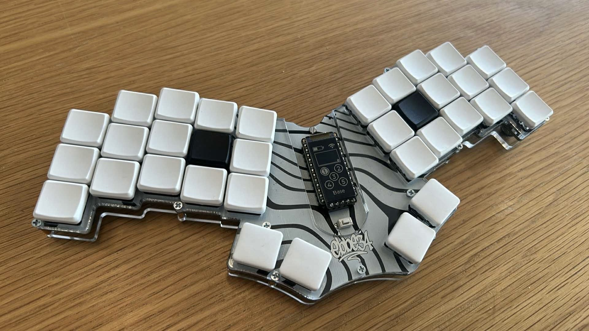

# ebbe34

**ebbe34** is a minimalist, ergonomic 34-key keyboard designed with portability in mind. It features a unibody layout, hot-swappable sockets compatible with Kailh Choc V1 and V2 low-profile switches, and nice!view display — powered by the nice!nano controller.

---

## 🧩 Parts Required

- **1×** nice!nano V2
- **1×** nice!view display
- **1×** Li-Po Battery 301230 (110 mAh)
- **1×** 2-pin THT Reset Switch
- **34×** Kailh Choc V1 or V2 Hotswap Sockets
- **34×** 1N4148W SMD Diodes

All required parts are available from [42keebs.eu](https://42keebs.eu).

---

## 🛠 Firmware

You can find the firmware [here](https://github.com/indianpojken/ebbe34-zmk).

---

## 📸 Images

  
_Built from revision `6ba714b`_

---

## 🙌 Credits

Inspiration and footprints from:

- [Urchin by duckyb](https://github.com/duckyb/urchin)
- [ScottoKeebs by joe-scotto](https://github.com/joe-scotto/scottokeebs/tree/main/Extras/ScottoKicad)
